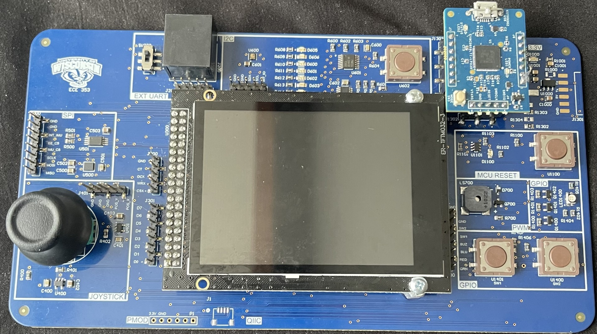

# Image Match Game – PSoC 6 Embedded Systems Project (Spring 2024)

This repository contains the embedded C implementation of a **two-player image matching game** designed for the **PSoC 6 microcontroller** platform. The project was developed as part of an embedded systems course, using custom instructor-provided boards and FreeRTOS for real-time multitasking.

---

## 🎮 Project Overview

The game is a **turn-based image matching competition** played across two PSoC 6 boards. Each player navigates a grid of images using a joystick and selects images using a button. The objective is to find all matching image pairs faster than the opponent.

- Boards communicate via **UART over an Ethernet cable**
- Game display and input are handled via onboard **LCD**, **joystick**, and **button**
- **FreeRTOS** is used to manage real-time tasks, including UI, input polling, communication, and game state
- A **buzzer** is used to give audio feedback when a player selects an image that was already revealed
- **Score** is displayed on individual boards via onboard **LEDs**
- **GAME OVER** is displayed when one player wins; the game resets with a button press

---

## 🖥️ Board Used

---

## 🧩 Features

- 🔄 **Turn-Based Multiplayer** – Two players alternate turns using synchronized state sharing over UART  
- 🎯 **Image Selection** – Joystick-based navigation with button-controlled selection  
- 🧠 **Memory Match Logic** – Backend game logic tracks selections, matches, and turn switching  
- 📟 **LCD UI** – Displays game board, instructions, and end-of-game messages  
- ✨ **LED Score Display** – Each board shows its player's score in real-time using RGB LEDs  
- 🔊 **Buzzer Feedback** – An audio tone is played if a player selects a previously revealed image  
- 🔁 **Restart Capability** – Game resets cleanly when button is pressed post-match  

---

## 🖥️ Technologies Used

- **PSoC 6 Microcontroller**  
- **ModusToolbox** IDE with GCC toolchain  
- **FreeRTOS** for task scheduling  
- **UART communication** protocol over physical Ethernet wiring  
- Custom **LCD display drivers**, **input handling**, and **game logic in C**  
- Onboard **joystick**, **buttons**, **buzzer**, **LEDs**, and **LCD** interfaces  

---

## 🔧 Development Notes

- The board hardware and base schematic were developed and provided by the instructor  
- All device drivers, game logic, and FreeRTOS task setup were implemented by the student team  
- UART synchronization was crucial to ensure consistent state across both boards  
- The buzzer is triggered when a player selects an image that has already been revealed, helping enforce the game rules with auditory feedback  
- The final game state and LED control were verified on hardware, though this repository may contain a near-final (but not final) build  

---

## 🎓 Course Info

This project was completed as part of:

**ECE 353 – Embedded Systems**  
University of Wisconsin–Madison, Spring 2024  
Instructor: [Joe Krachey]

---

## 📝 Acknowledgments

Thanks to the course staff for providing the board, baseline hardware support, and project framework. All software-level design, task coordination, and game logic were student-implemented.

---
